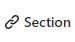

# Markdown

Markdown is a lightweight markup language that can be used to add formatting elements to plain text documents. GitHub released its own markdown language (GFM) based on original markdown. Markdown can be created or edited in any text editor and saved with an extension ".md". [DILLINGER](https://dillinger.io/) can be used to edit and preview Markdown files in real time. On GitHub markdown files are saved as README.md and it is automatically displayed in the repository. Markdown files can also be edited and previewed on GitHub.

---

---

Following topics about markdown language are explained here.

1. [Headings](README.md#1-headings)
2. [Paragraphs](README.md#2-paragraphs)
3. [Styling Text](README.md#3-styling-text)
4. [Tables](README.md#4-tables)
5. [Quoting](README.md#5-quoting)
6. [Links](README.md#6-links)
7. [Lists](README.md#7-lists)
8. [Content Attachment](README.md#8content-attachment)
9. [Using Emojis](README.md#9-adding-emojis)
10. [Ignoring Markdown Formatting](README.md#10-ignoring-markdown-formatting)
11. [Referencing](README.md#10-ignoring-markdown-formatting)
12. [Summary](README.md#12-summary)

---

---

## 1. Headings

To create a heading, add one to six `#` symbols before heading text. The number of `#` used will determine the size of the heading.

```
# The Largest heading.
## Second largest heading.
### Third largest heading.
#### Third smallest heading.
##### Second smallest heading.
###### The smallest heading.
```

# The Largest heading.

## Second largest heading.

### Third largest heading.

#### Third smallest heading.

##### Second smallest heading.

###### The smallest heading.

---

---

## 2. Paragraphs

For writing paragraphs leave a blank line between two lines.

```
In computer science, artificial intelligence (AI), sometimes called machine intelligence, is intelligence demonstrated by machines, in contrast to the natural intelligence displayed by humans and animals.

Machine learning (ML) is the study of computer algorithms that improve automatically through experience.
```

In computer science, artificial intelligence (AI), sometimes called machine intelligence, is intelligence demonstrated by machines, in contrast to the natural intelligence displayed by humans and animals.

Machine learning (ML) is the study of computer algorithms that improve automatically through experience.

---

---

## 3. Styling Text

Emphasis can be indicated with bold, italic, or strikethrough text. Methods to do the styling on the text is as follows:
| Style | Syntax | Keyboard shortcut | Example | Output |
| ---------------------- | ------------------ | ------------------- | ---------------------------------------- | -------------------------------------- |
| Bold | `** **` or `__ __` | command/control + b | `**This is bold text**` | **This is bold text** |
| Italic | `* * or _ _` | command/control + i | `*This text is italicized*` | _This text is italicized_ |
| Strikethrough | `~~ ~~` | | `~~This was mistaken text~~` | ~~This was mistaken text~~ |
| Bold and nested italic | `** ** and _ _` | | `**This text is _extremely_ important**` | **This text is _extremely_ important** |
| All bold and italic | `*** ***` | | `***All this text is important***` | **_All this text is important_** |

---

---

## 4. Tables

Tables are used to organize and present data. Following two things are discussed about tables here:

- Creating a table
- Formatting content within table

### Creating a Table

Tables are created using pipes | and hyphens -. Hyphens are used to create each column's header, while pipes separate each column. Blank line must be included before table in order for it to correctly render.

```
| First Header  | Second Header |
| ------------- | ------------- |
| Content Cell  | Content Cell  |
| Content Cell  | Content Cell  |
```

| First Header | Second Header |
| ------------ | ------------- |
| Content Cell | Content Cell  |
| Content Cell | Content Cell  |

The pipes on either end of the table are optional. There must be at least three hyphens in each column of the header row.

### Formatting content within table

Formatting such as links, inline code blocks, and text styling within tables can be used. Text can be aligned to the left, right, or center of a column by including colons : to the left, right, or on both sides of the hyphens within the header row.

```
| Left-aligned | Center-aligned | Right-aligned |
| :---         |     :---:      |          ---: |
|    Hassan    |      Ali       |     Khan      |
```

| Left-aligned | Center-aligned | Right-aligned |
| :----------- | :------------: | ------------: |
| Hassan       |      Ali       |          Khan |

To include a pipe | as content within cell, use a \ before the pipe:

```
| Name     | Character |
| ---      | ---       |
| Backtick | `         |
| Pipe     | \|        |
```

| Name     | Character |
| -------- | --------- |
| Backtick | `         |
| Pipe     | \|        |

---

---

## 5. Quoting

Text can be quoted in the markdown language along with text code can also be quoted.

For quoting a text start the text with >.

```
In the words of Abraham Lincoln:

> Pardon my French
```

In the words of Abraham Lincoln:

> Pardon my French

Code or a command cab be called out within a sentence with single backticks. The text within the backticks will not be formatted.

```
The number of `#` symbols used will determine the size of the heading.
```

The number of `#` symbols used will determine the size of the heading.

To format code or text into its own distinct block, use triple backticks.

````
Some basic Git commands are:
```
git status
git add
git commit
```
````

Some basic Git commands are:

```
git status
git add
git commit
```

---

---

## 6. Links

There are three types of links

- URL links
- Section links
- Relative Links

### URL Links

An inline link can be created by wrapping link text in brackets [ ], and then wrapping the URL in parentheses ( ). Keyboard shortcut command + k can also be used to create a Link.

`This page was built using [GitHub Pages](https://pages.github.com/).`

This page was built using [GitHub Pages](https://pages.github.com/).

### Section Links

A section can directly be linked in a rendered file by hovering over the section heading to expose the link:



### Relative links

Relative links and image paths can be defined in rendered files to help readers navigate to other files in the repository. A relative link is a link that is relative to the current file. For example, to move to the [PIAIC](../README.md) README file the relative link will be as follows:

`[PIAIC](../README.md)`

GitHub will automatically transform relative link or image path based on whatever branch users are currently on, so that the link or path always works. All relative link operands, such as ./ and ../ should be used. Relative links are easier for users who clone the repository. Absolute links may not work in clones of the repository. Using relative links is recommended to refer to other files within the repository.

---

---

## 7. Lists

Unordered list can be made by preceding one or more lines of text with - or `*`.

```
- George Washington
- John Adams
- Thomas Jefferson
```

- George Washington
- John Adams
- Thomas Jefferson
  Fer ordered list, precede each line with a number.

```
1. James Madison
2. James Monroe
3. John Quincy Adams
```

1. James Madison
2. James Monroe
3. John Quincy Adams

### Nested Lists

Nested list can be made by indenting one or more list items below another item.

```
1. First list item
   - First nested list item
     - Second nested list item
```

1. First list item
   - First nested list item
     - Second nested list item

### Task lists

To create a task list, preface list items with a regular space character followed by [ ]. To mark a task as complete, use [x].

```
- [x] Finish my changes
- [ ] Push my commits to GitHub
- [ ] Open a pull request
```

- [x] Finish my changes
- [ ] Push my commits to GitHub
- [ ] Open a pull request

If a task list item description begins with a parenthesis, escape it with `\`:

```
- [ ] \(Optional) Open a follow up issue
```

- [ ] \(Optional) Open a follow up issue

---

---

## 8.Content Attachment

Some GitHub Apps provide information in GitHub for URLs that link to their registered domains. GitHub renders the information provided by the app under the URL in the body or comment of an issue or pull request. For more information about building a GitHub App that uses content attachments, see [Using Content Attachments](https://developer.github.com/apps/using-content-attachments/) in theGitHub Developer documentation.

Simplest way to attach an image is to save the image in the repository and then using the following command

``

---

---

## 9. Adding Emojis

emojis can be added to writing by typing :EMOJICODE:.

`@octocat :+1: This PR looks great - it's ready to merge! :shipit:`

@octocat :+1: This PR looks great - it's ready to merge! :shipit:

For a full list of available emoji and codes, check out [Emojis Cheat Sheat](https://www.webfx.com/tools/emoji-cheat-sheet/).

---

---

## 10. Ignoring Markdown formatting

Markdown format can be ignored using `\` before the Markdown character.

`Let's rename \*our-new-project\* to \*our-old-project\*.`

Let's rename \*our-new-project\* to \*our-old-project\*.

---

---

## 11. Referencing

Users on GitHub can be mentioned using @ sign.
For referencing a pull or issue # sign is used.
Other instances can be mentioned using their links.

---

---

## 12. Summary

| Sr. No. | Topic                  |       Syntax        | Remarks                                                  |
| :-----: | ---------------------- | :-----------------: | -------------------------------------------------------- |
|    1    | Headings               |         `#`         | Use one to six `#` before a text to make headings        |
|    2    | Paragraphs             |                     | Leave an empty line b/w two lines to make it a paragraph |
|    3    | Bold                   | `** **` or `__ __`  | Write text in b/w.                                       |
|    4    | Italic                 |    `* * or _ _`     | Write text in b/w.                                       |
|    5    | Strikethrough          |       `~~ ~~`       | Write text in b/w.                                       |
|    6    | Bold and nested italic |   `** ** and _ _`   | Write text in b/w.                                       |
|    7    | All bold and italic    |      `*** ***`      | Write text in b/w.                                       |
|    8    | Tables                 |    \| and `---`     | Pipes for columns and Backtick for row                   |
|    9    | Quotes                 |      \> and \`      | \> for quoting text, \` for code                         |
|   10    | Links                  |   `[Title](URL)`    | Linking a URL , same way for relative and section links  |
|   11    | Lists                  | `- or * or numbers` | for unordered or ordered list                            |
|   12    | Content Attachment     | `` | To attach a file from repo.                              |
|   13    | Adding Emojis          |    `:EMOJICODE`     | Add Emojis                                               |
|   14    | Ignore format          |         `\`         | Use before format                                        |
|   15    | Reference              |       @ or #        | use before name                                          |

---

---
