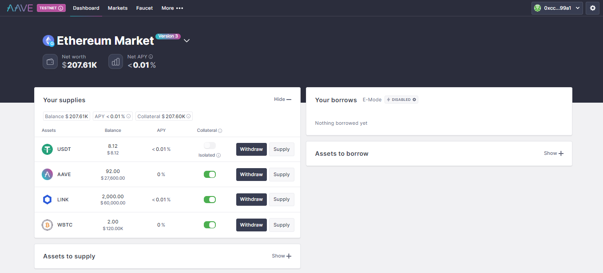
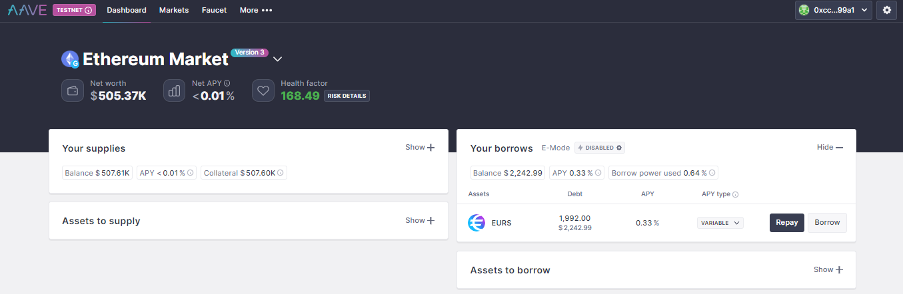
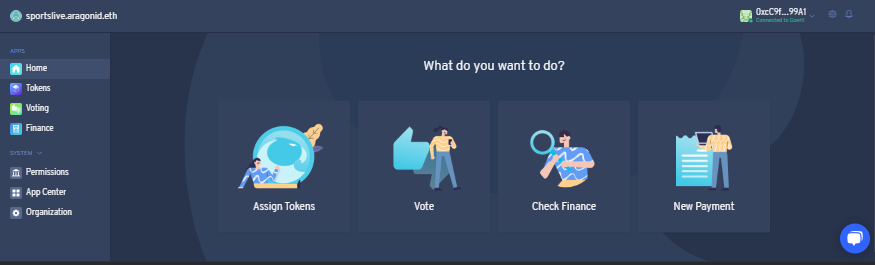
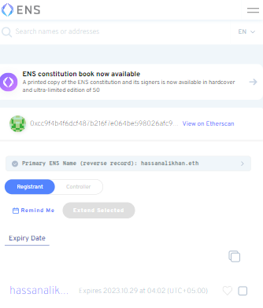

# Assignment

## Supply and Borrow Assets with Aave Protocol

- Visit (Aave app)[https://app.aave.com/] and link your wallet with on testnet.
- List of all holded coins available on the app
- Select one of the coin to supply to he aave protocol
- From assets to supply select amount and supply
- Supply transaction Ether Scan URL `https://goerli.etherscan.io/tx/0xce376a0428ad66eed62b9bed4167bdd55be16675bac7fd4583cfcfe00b3c886b`

  

- From assets to borrow select amount and borrow
- Borrow transaction Ether Scan URL `https://goerli.etherscan.io/tx/0x492a7fb6cbe5c3e90266a3664e84bf543fd5d57cdd83694ddab55cc1e79f19ea`

  

## Create DAO and Add Members

- Visit [Aragon](https://aragon.org/) and naviagte to [client](https://client.aragon.org/#/)
- By switing to testnet connect your wallet
- Create an organization, use comapny template, define company name, configure template, add members and verify details before launching your organization
- Ether Scan URL `https://goerli.etherscan.io/tx/0x2ebac33796668cbd3c76873fb068330cae3072ee72695afc332bd5d61f5f8b54`
- `sportslive.aragonid.eth`

  

- You can create a new vote or vote on an excisting one

## Fundraising Presentation for New Web3 Projects

- [Google slides](https://docs.google.com/presentation/d/1QGqBc04fD92BFsEDDhH-qCnuFqfMbh0FkeATsvEEKuw/edit?usp=sharing)

## Register Your Domain at ENS Service

- Visit [ens domain](https://app.ens.domains/), don't forget to connect through VPN
- Connect wallet and switch to testnet
- Search domain to buy
- Request register which deducts a fee from wallet
- After waiting for a few minutes register by paying some fee
- Registed domain are available in account menu
- You can assign a domain as your primary ens name
- `hassanalikhan.eth`

  
